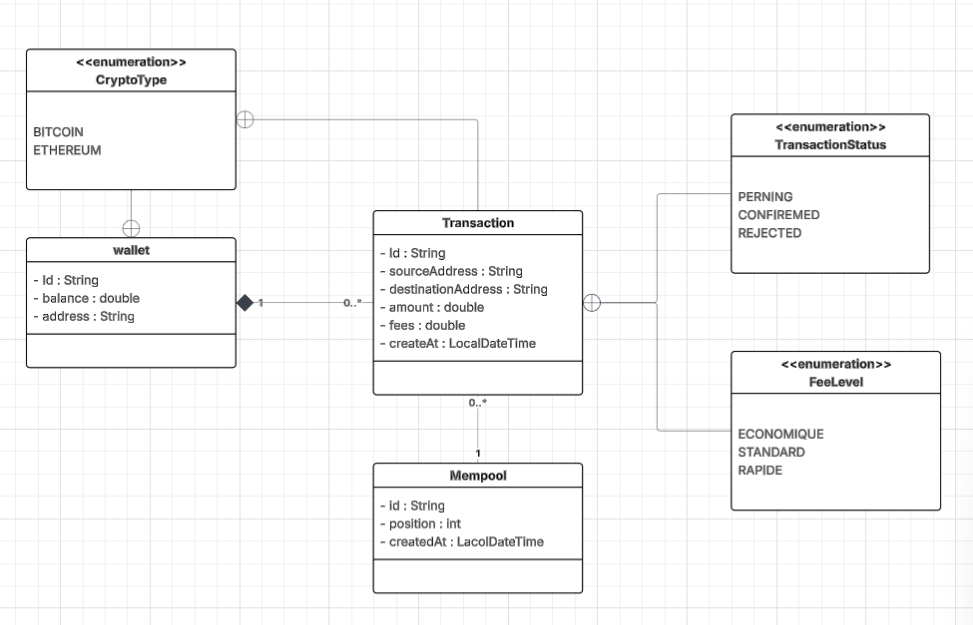
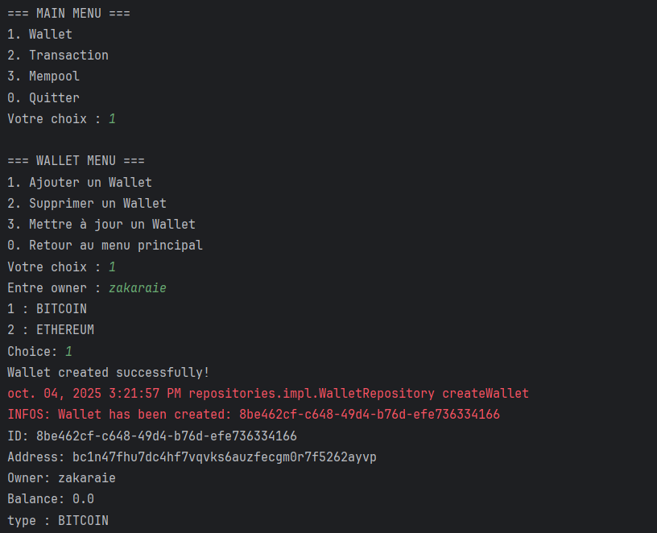
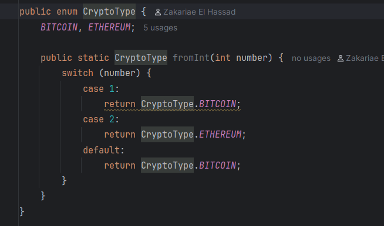
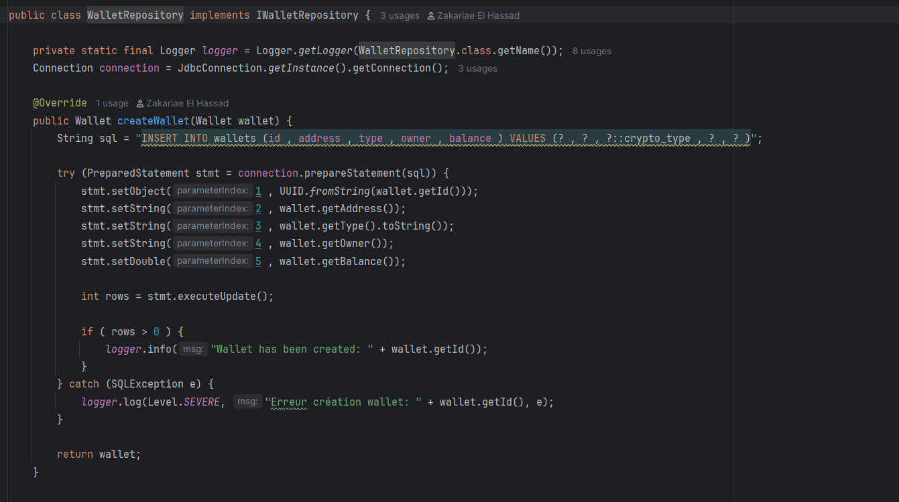

# Crypto Wallet Simulator

**Application console (Java 8)** simulant un wallet crypto avec mempool et calculateur de fees pour aider l'utilisateur à optimiser ses transactions.

---

## 📌 Description

Ce projet est une application console développée en **Java 8** (javac/java, Maven interdit) qui simule :

* la création d'un wallet (Bitcoin ou Ethereum),
* la génération de transactions avec différents niveaux de fees (ÉCONOMIQUE / STANDARD / RAPIDE),
* un mempool simulé (file d'attente priorisée par fees),
* l'estimation de la position dans le mempool et du temps d'attente.

L'application respecte une architecture en couches (présentation, métier, données, utilitaires) et applique les principes SOLID.

---

## ✅ Fonctionnalités principales

* Créer un wallet crypto (BITCOIN ou ETHEREUM) avec adresse générée et solde initial à 0
* Créer une transaction : source, destination, montant, niveau de fees
* Calculer les fees selon le type de crypto et la priorité choisie
* Afficher l'état courant du mempool (liste de tx en attente, fees, votre tx)
* Persistences SQL : scripts PostgreSQL + accès via JDBC
* Logging (SLF4J/Logback ou java.util.logging) — erreurs et opérations critiques

---

## 🧰 Technologies & contraintes

* **JDK 8** (obligatoire)
* **javac / java** pour compilation/exécution (Maven interdit)
* Collections Java : `ArrayList`, `HashMap`
* Java Time API (`java.time`) pour dates/heures
* Streams API (`map`, `filter`, `reduce`, `Optional`)
* JDBC Driver for PostgreSQL pour persistance
* Design patterns obligatoires : **Singleton**, **Repository Pattern**
* Enums obligatoires pour : `CryptoType`, `FeeLevel`, `TxStatus`

---

## 📂 Structure suggérée du projet

```
crypto-wallet-simulator/
├─ src/
│  ├─ config/       # Menu console, Main
│  ├─ models/            # Services métiers (WalletService, TxService, MempoolService)
│  ├─ presentation/              # Entités : Wallet, Transaction, enums, DTOs
│  ├─ repositories/         # Repository interfaces + Postgres implementation (JDBC)
│  ├─ services/               # Utils : ValidationUtils, FeeCalculator, AddressGenerator
│  ├─ utili/               # Configuration DB, Logger
│  ├─ Main               
│  └─ sql.sql            # Script de création des tables
├─ README.md
└─ UML/                  # diagramme de classes
```

---

## 🎯 Modèles de classes (résumé)

* `class Wallet`

    * id : UUID
    * address : String
    * type : CryptoType (BITCOIN / ETHEREUM)
    * balance : double
    * transactions : List<Transaction>

* `class Transaction`

    * id : UUID
    * fromAddress, toAddress : String
    * amount : double
    * fee : double
    * feeLevel : FeeLevel (ECONOMIQUE / STANDARD / RAPIDE)
    * status : TxStatus (PENDING / CONFIRMED / REJECTED)
    * createdAt : LocalDateTime
    * cryptoType : CryptoType

* `enum CryptoType { BITCOIN, ETHEREUM }`

* `enum FeeLevel { ECONOMIQUE, STANDARD, RAPIDE }`

* `enum TxStatus { PENDING, CONFIRMED, REJECTED }`

---

## ⚙️ Calcul des fees (exemples fictifs réalistes)

* **Bitcoin** : `fee = estimatedSizeBytes × satoshiPerByte`

    * Exemple de paramètres (fictifs) :

        * taille estimée = 250 bytes
        * ECONOMIQUE = 1 sat/byte, STANDARD = 5 sat/byte, RAPIDE = 15 sat/byte
        * conversion satoshis → BTC ou USD (optionnel) dans l'affichage

* **Ethereum** : `fee = gasLimit × gasPrice`

    * Exemple de paramètres :

        * gasLimit = 21000
        * gasPrice ECONOMIQUE = 10 gwei, STANDARD = 50 gwei, RAPIDE = 120 gwei

> Utiliser des constantes dans `FeeConfig` pour centraliser ces valeurs.

---

## 🧾 Validations & règles métier

* Montant strictement positif
* Format d'adresse :

    * Ethereum : commence par `0x` + 40 hex chars (regex `^0x[0-9a-fA-F]{40}$`)
    * Bitcoin : commence par `bc1` (validation simple via regexs)
* Vérifier solde suffisant avant création (selon règles du wallet)
* Niveaux de fees valides (utiliser enums)
* Exceptions métier personnalisées : `InvalidAddressException`, `InsufficientBalanceException`, `WalletNotFoundException`

---

## 🗄️ Persistance PostgreSQL (via JDBC)

Fournir un script SQL `sql.sql` contenant :

* `wallets` (id UUID, address, type, balance)
* `transactions` (id UUID, wallet_id, from_addr, to_addr, amount, fee, fee_level, status, created_at, crypto_type)

Exemple minimal de script :

```sql
CREATE TABLE wallets (
  id UUID PRIMARY KEY,
  address TEXT NOT NULL UNIQUE,
  type TEXT NOT NULL,
  balance NUMERIC DEFAULT 0
);

CREATE TABLE transactions (
  id UUID PRIMARY KEY,
  wallet_id UUID REFERENCES wallets(id),
  from_addr TEXT,
  to_addr TEXT,
  amount NUMERIC NOT NULL,
  fee NUMERIC NOT NULL,
  fee_level TEXT,
  status TEXT,
  created_at TIMESTAMP
);
```

Dans `repository/` implémenter `WalletRepository` et `TransactionRepository` avec JDBC (Singleton pour la connexion DB).

---

## 🧩 Menu console (exemples d'options)

```
=== MAIN MENU ===
1. Wallet
2. Transaction
3. Mempool
0. Quitter
Votre choix : 
```

Chaque option appelle les services métiers — afficher les résultats via `System.out.println` (strictement pour UI) ; les erreurs et logs doivent passer par un `Logger`.

---

## 📷 UML & Livrables

Livrables à fournir sur GitHub :

* Diagramme de classes (UML)
* 
* Capture d'écran démontrant l'exécution
* 
* 
* 


---

## ✅ Critères de réussite

* Application développée exclusivement avec **Java 8**
* Architecture en couches respectée
* Utilisation d'enums, design patterns demandés et principes SOLID
* Logs corrects (Logger pour erreurs)
* README clair et complet, UML fidèle

---

## ✉️ Contact

Pour toute question : `Zakariae El Hassad` (auteur du projet)

---

Bonne implémentation ! 🚀
